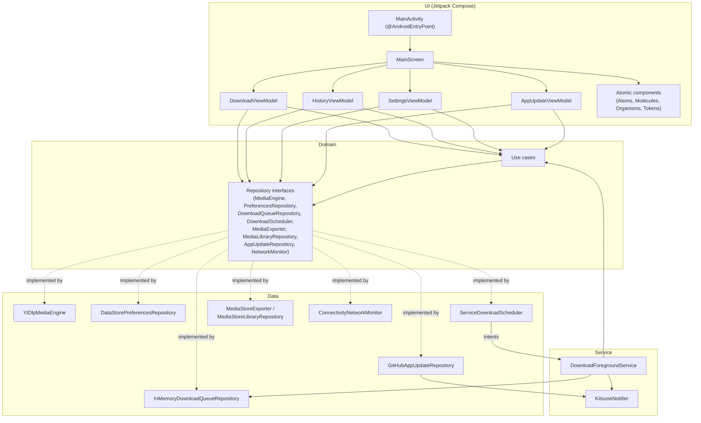
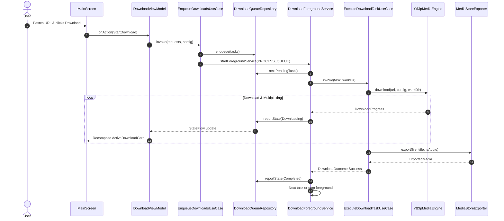

# Kitsune System Architecture

This document describes the architectural principles, component structure, data flow, and design system implementation of the **Kitsune** Android application.

---

## 1. Architectural Overview

Kitsune is designed around **Clean Architecture**, **Unidirectional Data Flow (MVI/MVVM)**, and Brad Frost's **Atomic Design System** mapped to modern **Jetpack Compose** primitives. Dependencies are wired with **Hilt**.

The code is split into four layers inside the `:app` module:
1. **UI (`ui`)**: Jetpack Compose screens and Atomic Design components. Each feature owns a `@HiltViewModel` with an `@Immutable` state and a sealed action interface: `DownloadViewModel`, `HistoryViewModel`, `SettingsViewModel` and `AppUpdateViewModel`. `MainScreen` composes the four states and routes `MainUiAction`s to the right ViewModel.
2. **Domain (`domain`)**: Models, repository interfaces and use cases (`AnalyzeLinkUseCase`, `LoadDownloadConfigUseCase`, `EnqueueDownloadsUseCase`, `CancelDownloadsUseCase`, `ExecuteDownloadTaskUseCase`, `CheckForAppUpdateUseCase`). It does not depend on `data`, `service` or `ui`.
3. **Data (`data`)**: Implementations of the domain interfaces: `YtDlpMediaEngine` (yt-dlp / FFmpeg), `DataStorePreferencesRepository`, `InMemoryDownloadQueueRepository`, `ServiceDownloadScheduler`, `MediaStoreExporter`, `MediaStoreLibraryRepository`, `GitHubAppUpdateRepository` and `ConnectivityNetworkMonitor`.
4. **Service (`service`)**: `DownloadForegroundService` processes the shared download queue in the background and `KitsuneNotifier` owns every notification.

`di/AppModule` provides the DataStore, the IO dispatcher and the application scope; `di/DataModule` binds each domain interface to its implementation.



---

## 2. Presentation Layer: Atomic Design in Jetpack Compose

The UI layer is organized strictly following the Atomic Design methodology. Each level has well-defined dependencies: a component may only depend on components at the same level or lower levels.

```
Template
  └── Organisms
        └── Molecules
              └── Atoms
                    └── Tokens (KitsuneTheme)
```

### 2.1 Design Tokens (`ui/theme/tokens`)
Tokens are the atomic values defining color, typography, spacing, and shapes:
- **`KitsuneColorTokens`**: Defines brand accents (`accentCyan`, `accentIndigo`, `accentOrange`, `accentPurple`), dark backgrounds (`background`, `surface`, `surfaceElevated`), and semantic states (`success`, `error`), with full support for pure OLED black (AMOLED).
- **`KitsuneSpacingTokens`**: Strict spacing scale (`xxs: 2.dp` up to `xxl: 48.dp`).
- **`KitsuneShapeTokens`**: Corner radiuses (`pill: 999.dp`, `cardRadius: 24.dp`, `inputRadius: 16.dp`, `sheetRadius: 28.dp`).
- **Access Pattern**: Provided via `CompositionLocalProvider` (`LocalKitsuneColors`, `LocalKitsuneSpacing`, `LocalKitsuneShapes`) and queried using `KitsuneTheme.colors`, `KitsuneTheme.spacing`, and `KitsuneTheme.shapes`. All getters are annotated with `@ReadOnlyComposable` to skip recomposition registration.
- **MultiPreview**: `@ThemePreviews` provides dual preview capabilities (Standard Dark and Pure AMOLED Black) directly in Android Studio.

### 2.2 Atoms (`ui/components/atoms`)
Single-purpose, highly reusable composables with slot APIs:
- **`KitsuneButton`**: Button component supporting `PRIMARY`, `SECONDARY`, and `ACCENT` visual variants, loading spinners, and pill shapes.
- **`KitsuneIconButton`**: Circular icon buttons with pressed/hover ripple states and minimum 48dp touch targets.
- **`KitsuneBadge`**: Compact pill badges displaying extraction status or platform tags.
- **`KitsuneTextField`**: Custom styled input field supporting prefix icons, clear actions, and edge-to-edge keyboard padding.
- **`KitsuneLinearGauge`**: Smoothly animated progress indicator utilizing `animateFloatAsState`.
- **`MascotSvg`**: Reactive mascot rendering dynamic emotional states (`IDLE`, `DOWNLOADING`, `COMPLETED`, `ERROR`) using Lottie Compose with seamless marker/frame loop clipping and SVG fallback.

### 2.3 Molecules (`ui/components/molecules`)
Composites of two or more atoms forming functional units:
- **`UrlInputBar`**: Combines `KitsuneTextField`, clipboard paste button, clear button, and submit action.
- **`KitsuneModeSelector`**: Segmented selector for `AUTO` (Video), `AUDIO`, and `MUTE` extraction modes.
- **`MediaPreviewCard`**: Media item preview showing remote thumbnail, title, uploader, and duration.
- **`DownloadStatusDisplay`**: Displays active download stage, percentage, download speed, and estimated time remaining (ETA).
- **`QualityOptionTile`**: Selectable resolution or audio bitrate tile.

### 2.4 Organisms (`ui/components/organisms`)
Discrete screen regions handling complex domain tasks:
- **`MainInputCard`**: Core hero card housing the mode selector, input bar, detected platform badge, media preview, and trigger button.
- **`ActiveDownloadCard`**: Real-time progress monitor card appearing during active downloads.
- **`DownloadSettingsSheet`**: Modal bottom sheet configuring resolution, audio codecs (MP3, Opus, M4A), bitrate, subtitles, AMOLED pure black theme, and yt-dlp version status.
- **`DownloadsHistorySheet`**: Modal bottom sheet listing downloaded files with options to open, share, rename, or delete.
- **`KitsuneMediaPlayerDialog`**: High-performance in-app player leveraging Media3 ExoPlayer for videos and animated mascot playback for audio, supporting direct Android Share Sheet intent dispatching.
- **`SupportedServicesDialog`**: Information modal listing supported content providers.
- **`TermsDialog`**: Legal disclaimer and fair-use policy modal.

### 2.5 Templates, Screen & Feature ViewModels (`ui/components/templates`, `ui/main`, `ui/<feature>`)
- **`KitsuneScreenTemplate`**: Pure structural scaffold managing status/navigation bar insets (`WindowInsets.statusBars`, `WindowInsets.navigationBars`), vertical scrolling, header placement, and floating sheet anchors.
- **`MainScreen`**: Obtains the feature ViewModels, collects their states with `collectAsStateWithLifecycle`, shows their one-off messages (`UiText`) as toasts, and routes each `MainUiAction` to the ViewModel that owns it. Which sheet or dialog is open is kept in a saveable `MainOverlay`.
- **`MainScreenContent`**: Stateless composable that renders `DownloadUiState`, `HistoryUiState`, `SettingsUiState` and `AppUpdateUiState`.
- **Feature contracts**: `DownloadUiAction`, `HistoryUiAction`, `SettingsUiAction` and `AppUpdateUiAction` are sealed interfaces extending `MainUiAction`; every state class is `@Immutable`.

---

---

## 3. Core Engine & Native Execution Layer

Kitsune bundles native binaries of `yt-dlp` and `FFmpeg` through the `youtubedl-android` wrapper.



### 3.1 Lazy Warmup & Mutex Thread Safety
Native NDK libraries require decompression and initialization upon app launch. To avoid UI jank:
- Initialization is kicked off during `Application.onCreate()` inside `KitsuneApp`, which calls `MediaEngine.warmUp()` on the injected `@ApplicationScope` coroutine scope.
- `YtDlpMediaEngine.warmUp()` uses a Kotlin `Mutex.withLock` to guarantee that concurrent requests wait for a single initialization routine rather than throwing duplicate extraction errors.
- Every yt-dlp invocation gets its own process id; cancelling the calling coroutine destroys the native process.

### 3.2 URL Sanitization & Platform Detection
`UrlDetector` performs fast regex evaluation against incoming URLs to identify supported platforms (YouTube, TikTok, Instagram, Twitter/X, Reddit, Bilibili, SoundCloud, Pinterest).
Before execution, `UrlDetector.sanitizeUrl()` strips tracking parameters:
- General UTM tags (`utm_source`, `utm_medium`, `utm_campaign`, etc.)
- Platform identifiers (`si`, `igsh`, `igshid`, `fbclid`, `gclid`, `ref_src`, `share_id`), plus `s` and `t` on Twitter/X links only
- Percent-encoding, fragments and YouTube timestamps are preserved

### 3.3 Dynamic Engine Updates (`MediaEngine.updateEngine`)
`YtDlpMediaEngine.updateEngine()` provides rolling updates to the yt-dlp binary:
- Invokes `YoutubeDL.getInstance().updateYoutubeDL(context, UpdateChannel.STABLE)` on the injected IO dispatcher.
- Allows users to patch extractors immediately when upstream platforms change their API, without waiting for a full app release.

---

## 4. Android Platform Services & Storage Architecture

### 4.1 Foreground Service & Wake Lock
Background downloads are executed by `DownloadForegroundService`:
- Declared in `AndroidManifest.xml` with `android:foregroundServiceType="dataSync"`.
- Requests `PARTIAL_WAKE_LOCK` via `PowerManager` to prevent CPU throttling or deep sleep during high-bitrate video downloads or intensive FFmpeg remuxing.
- Communicates progress to the system via `KitsuneNotifier`, posting updates with low alert frequency (`onlyAlertOnce = true`) and offering a cancel action.

### 4.2 Scoped Storage & MediaStore Export
Starting with Android 10 (API 29), direct file path access to external storage is restricted. Kitsune is fully Scoped Storage compliant:
1. `YtDlpMediaEngine` downloads each queued item into its own isolated cache directory (`context.cacheDir/kitsune_tmp/<taskId>/`) and reports the final file path through `--print-to-file after_move:filepath`.
2. Upon download completion, `MediaStoreExporter` names the file after the media title and creates an entry in `MediaStore.Video.Media.EXTERNAL_CONTENT_URI` (for videos) or `MediaStore.Audio.Media.EXTERNAL_CONTENT_URI` (for audio tracks), with the MIME type derived from the file extension.
3. On API 29+, the entry is created with `IS_PENDING = 1` into `Movies/Kitsune` or `Music/Kitsune`; if streaming fails, the pending entry is deleted.
4. File bytes are streamed from cache to the MediaStore URI.
5. `IS_PENDING` is updated to `0`, immediately registering the file in the user's gallery and media players.
6. On API 26-28, the file is copied directly into the public `Movies/Kitsune` or `Music/Kitsune` folder (requires `WRITE_EXTERNAL_STORAGE`, declared with `maxSdkVersion="28"`) and indexed with `MediaScannerConnection`.
7. The task's temporary directory is always purged, including after failures and cancellations. Cancelling a task destroys the underlying yt-dlp process.

---

## 5. Security, ProGuard & Privacy Posture

- **No Remote Telemetry**: Kitsune does not include Google Analytics, Firebase, or external telemetry libraries.
- **Local Network Only**: Network requests are exclusively initiated by the `yt-dlp` binary directly to the content host.
- **Safe Sandboxing**: Temporary files are kept in internal storage until explicitly exported to the user's public media library.
- **ProGuard / R8 Optimization**: Explicit keep rules preserve native JNI methods, Media3 ExoPlayer decoders, and Lottie reflection paths for stable, obfuscated production releases.
